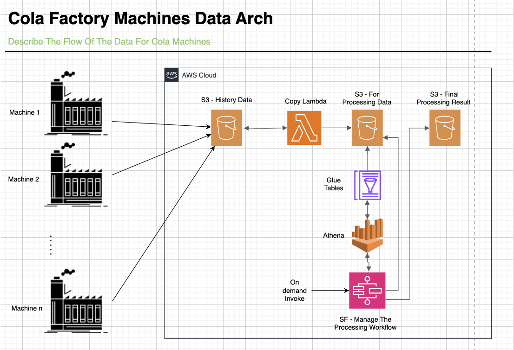

# Cola Factory Data Engineering

## Overview

The Cola Factory Data Engineering project serves not only as a robust solution for processing data from cola factory machines but also as a template for efficient data engineering with AWS. This project encapsulates the organized deployment of necessary resources to AWS, making it an ideal starting point for similar endeavors.

### Key Features:

1. **Organized Deployment:**
   - The project streamlines the deployment process, ensuring a well-organized structure for AWS resources. This structure is not only beneficial for the current use case but also serves as a foundation for future data engineering projects.

2. **Environment Management:**
   - Recognizing the need for deploying multiple environments, the project incorporates Terraform workspaces for effortless environment management. This enables users to create, switch, and maintain different environments with ease.
    
3. **Inspiration for Data Projects:**
   - Beyond its primary purpose, this project stands as an inspiration for individuals and teams embarking on data projects. Whether it's data processing, analytics, or any other data-related endeavor, the organized structure and deployment approach showcased here can significantly reduce the effort needed for deployment across multiple environments.

By adopting this template, users can leverage AWS services effectively, adhere to best practices, and accelerate the development and deployment of data projects. The project's modular structure and environment management capabilities make it a valuable resource for anyone aiming to build and deploy data solutions with minimal effort.

## High Level Arch



## Components

### 1. AWS Services

- **AWS S3:** Central hub for storing raw data, processed results, and interim data during processing.

- **AWS Step Functions:** Orchestrates end-to-end data processing, managing tasks from result identification to file deletion.

- **AWS Lambda:** Serverless functions for copying, transforming, and initiating workflow steps.

- **Amazon Athena:** Enables SQL-based querying on semi-structured data stored in S3 for interactive analysis.

### 2. Python

- Python scripts within Lambdas are crucial for common data operations like copying, moving, deleting, and running Athena queries. Additionally, separate deployment scripts are employed to facilitate specific deployment tasks, including creating schema changes (e.g., Glue table creation) and updating configuration files in S3. These deployment scripts ensure a seamless deployment process and ongoing adaptability to changing needs.

### 3. Terraform

- Infrastructure as Code (IaC) using Terraform for provisioning and managing AWS resources. The project is organized into modular and reusable Terraform modules for easy deployment and maintenance.
Certainly! Here's an updated version of the "How to Deploy" section, emphasizing the prerequisites of having Python, Terraform, and AWS account credentials in place:

## How to Deploy

To deploy the Cola Factory Data Engineering project, follow the steps below:

### Prerequisites:

Before proceeding, ensure you have the following prerequisites set up:

1. **Python Installation:**
   - Make sure Python is installed on your machine. If not, download and install Python from [python.org](https://www.python.org/downloads/).

2. **Terraform Installation:**
   - Ensure Terraform is installed on your machine. You can download Terraform from [terraform.io](https://www.terraform.io/downloads.html).

3. **AWS Account:**
   - You must have an AWS account. If you don't have one, you can create an account on the [AWS website](https://aws.amazon.com/).

4. **AWS Credentials:**
   - Set up your AWS credentials by configuring the AWS CLI or exporting environment variables with your access key and secret key. For more information, refer to the [AWS documentation on configuring credentials](https://docs.aws.amazon.com/cli/latest/userguide/cli-configure-files.html).

### Deployment Steps:

To deploy the Cola Factory Data Engineering project, follow the steps below:

1. **Clone the Repository:**
   ```bash
   git clone https://github.com/Mostafa-Alshaer/cola-factory-data-engineering.git
   cd cola-factory-data-engineering/deployment/cloud-resources/terraform/aws/main
   ```
   
2. **Create Terraform State Bucket:**
   - Manually create an S3 bucket in your AWS account named `cola-factory-data-team-deployment` to hold the Terraform state files.
   
3. **Initialize Terraform:**
   ```bash
   cd terraform
   terraform init
   ```

4. **Create Terraform Workspace:**
   - Create a Terraform workspace corresponding to the environment name:
     ```bash
     terraform workspace new <environment-name>
     ```

   - Switch to the created workspace:
     ```bash
     terraform workspace select <environment-name>
     ```

5. **Deploy Infrastructure:**
   ```bash
   terraform apply
   ```

6. **Set Python Environment Variable:**
   - Set the Python variable `ENVIRONMENT` to the environment name (workspace) created in the previous steps.

     ```bash
     export ENVIRONMENT=<environment-name>
     ```

7. **Run Athena Schema Creation Script:**
   - Execute the Python script to create the required Athena schema:
     ```bash
     cd ../../../../athena-schema
     python run-new-athena-scripts.py
     ```

8. **Run Config File Update Script:**
   - Execute the Python script to update/create the config file in S3, which will be used by the Step Functions process:
     ```bash
     cd ../../../../config
     python update-config-files.py
     ```

9. **Run Test Data Generation Script:**
   - Execute the Python script under the `test` folder to generate test records and push them as a file to S3 for testing:
     ```bash
     cd ../../test
     python generate_test_data.py
     ```

10. **Monitor Execution:**
    - Observe the AWS Step Functions console for the progress of the data processing workflow.

11. **Access Results:**
    - Utilize Athena for querying and analyzing the processed data in the designated S3 output locations.

These steps ensure a smooth deployment process, leveraging Python and Terraform for orchestrating the data engineering workflow on AWS.

## Project Structure Overview

The Cola Factory Data Engineering project is organized into three main folders, each serving a distinct purpose:

### 1. **deployment/**
   - **Purpose:** This folder is dedicated to deployment-related activities. It contains Terraform configurations for provisioning AWS resources, ensuring infrastructure as code (IaC) principles. Additionally, it houses Python scripts responsible for environment deployment tasks. These scripts automate the deployment process, handling tasks such as deploying Athena schema changes and updating configuration files. The deployment folder ensures a streamlined and fully automated deployment experience.

### 2. **src/**
   - **Purpose:** The src (source) folder contains the source code and essential scripts for the data processing workflow. It encompasses JSON files defining AWS Step Functions workflows, SQL scripts for creating and modifying Athena schemas, and metadata to manage incremental changes. This folder encapsulates the core logic of the data engineering project, facilitating maintainability of the workflow components.

### 3. **test/**
   - **Purpose:** The test folder is designated for testing-related activities. Currently, it includes scripts for generating test data. In the future, this folder may expand to accommodate additional automation scripts for testing purposes. The presence of a dedicated test folder emphasizes the project's commitment to ensuring the reliability and quality of its data processing workflow through testing practices.

This organized structure enhances clarity, modularity, and maintainability, supporting a systematic approach to development, deployment, and testing. Each folder plays a crucial role in the overall project lifecycle, contributing to the project's efficiency and scalability.

## Streamlined CI/CD and Effortless Environment Management

1. **Jenkins Integration:** DevOps teams can effortlessly set up Jenkins jobs for CI/CD, leveraging the project's simple deployment steps. The modular structure facilitates automation across various environments.

2. **Ongoing Changes Made Easy:** The project handles ongoing changes seamlessly, supporting hassle-free deployments for tweaks or significant updates. The incremental approach and schema management ensure a smooth deployment lifecycle.

3. **Effortless Environment Creation:** Switching between environments is a breeze with Terraform workspaces. Creating new environments requires minimal effort, emphasizing a swift and uncomplicated deployment process. The project prioritizes efficiency in managing multiple environments concurrently.

## Security and Permissions

Ensure that AWS IAM roles and policies are appropriately configured for Lambda functions, Step Functions, Athena, and Glue jobs. Follow the principle of least privilege to enhance security.

## Future Enhancements

Explore opportunities for enhancing the Cola Factory Data Engineering project:

1. **Error Handling:**
   - Implement robust error handling within Lambda functions for better debugging and resilience.

2. **Notifications with SNS:**
   - Integrate Amazon SNS for event notifications, keeping stakeholders informed about pipeline events.

3. **Cost Optimization:**
   - Optimize costs by considering strategies like leveraging spot instances for Glue jobs.

4. **Modular Extensions:**
   - Extend the pipeline to handle new report types or formats introduced by cola factory machines.

5. **Machine Learning Integration:**
   - Investigate integrating machine learning for predictive analytics or anomaly detection.

6. **Historical Data Archiving:**
   - Implement periodic archiving of historical data for efficient storage management.

7. **Custom Dashboards:**
   - Develop custom analytics dashboards for user-friendly data visualization.

8. **Cross-Region Replication:**
   - Enhance disaster recovery by implementing cross-region replication for critical data.

These enhancements aim to improve error handling, analytics, cost-effectiveness, and overall flexibility in response to evolving project needs.

## Contributors

- [Mostafa Alshaer](https://github.com/Mostafa-Alshaer)

---